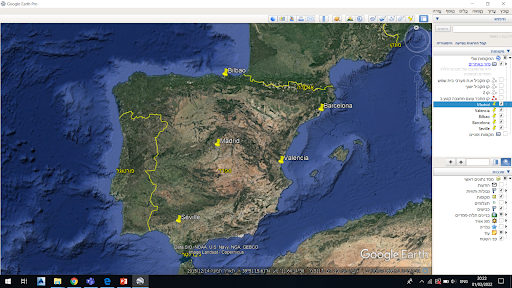
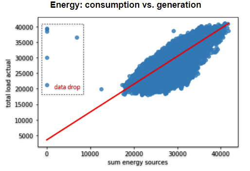
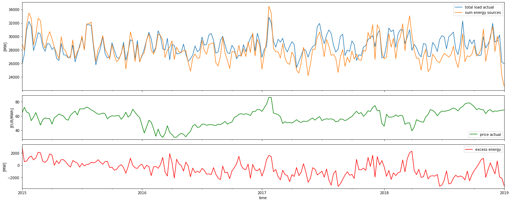
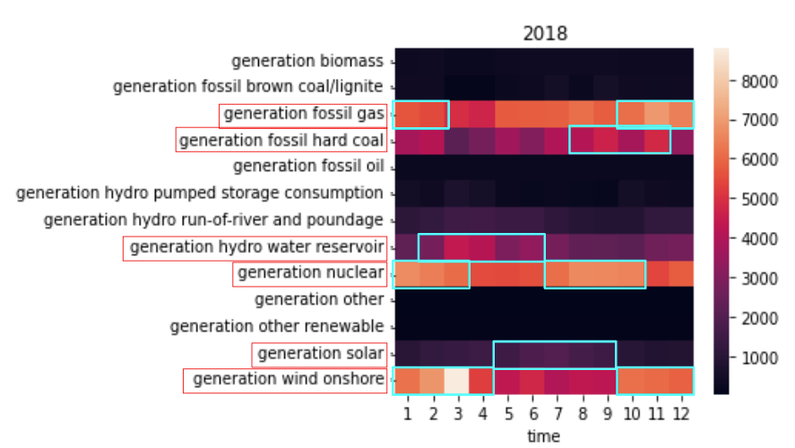
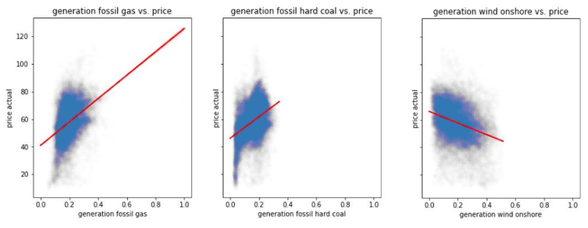
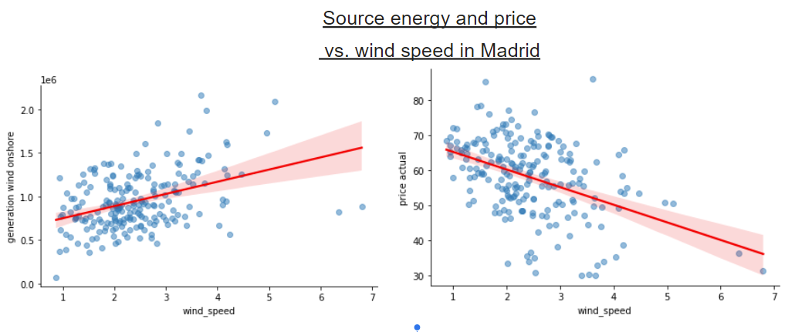

# EDA - Energy Demand Generation and Weather 

The dataset contains hourly intervals of electrical consumption, generation, pricing and weather data in Spain. 
The project focused on Exploratory Data Analysis (EDA): data cleaning and updating, trends and relationship between variables.

  

2 csv files - [Kaggle dataset](https://www.kaggle.com/datasets/nicholasjhana/energy-consumption-generation-prices-and-weather?select=weather_features.csv):
- Energy dataset:   contains 4 years (2014-2018) of hourly electrical consumption, generation and pricing in Spain.
- Wheather dataset: contains 4 years (2014-2018) of hourly whether measurments in 5 cities in Spain: Madrid, Valencia, Bilbao, Barcelona and Seville.

## Hypothesis : Weather factors affect energy consumption and generation, which affect energy prices.

### Assumption

- Cities are distribution is relatively wide, therefore we will assume that the weather of all of Spain can be represented by these cities.
- All cities have similar number of measurements.

  

### Data Dropping
    
- Energy Dataset: Measurements with high consumption and very low generation (10,000): 

  

- Weather Dataset:

  - Data with exceptional pressure (< 900 hPa, > 1100 hPa)
  - Data with hourly rainfall of 12 mm in Barcelona in summer 2016 (after checking the site that displays the weather data, an incorrect figure appears).
  - Exceptional wind speed- 133 m/s in July (one observation).

  
### Energy generation, consumption and price as function of time

  Energy consumption and generation seem to have peaks around the summers and the winters. energy prices seem to generaly raise in the same times.
  In January 2016, there is a relative decrease in the price of energy that is not in the same trend of energy production and consumption.
  
  

  

  
### Different energy sources usage in mounthly usage and their effect on energy prices

Predominant energy sources in Spain: fossil gass , hard coal ,wind.
Around february and march there is an increase of use of wind and energy and hydro water reservoir and decrease in the use of hard coal energy, while around june-september there is an increase in the use of solar energy and decrease in the use of wind energy.

  

Energy prices seem to increase with the use of fossil energy sources and to decrease with use of wind sources.

  

Wind energy generation seem to increased with higher wind speed.
With higher wind speeds energy prices seem to drop.
With higher wind speeds, more energy is generated from wind and less hard coal is burnt, therefore energy prices drop.

  

