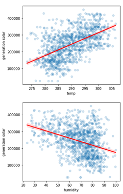

# EDA - Energy Demand Generation and Weather 
Data analysis exploration of 4 years of electrical consumption, generation, pricing, and weather data for Spain.  Hypothesis Investigation: Weather factors affect energy consumption and generation, which affect energy prices. 

  

2 csv files - [Kaggle dataset](https://www.kaggle.com/datasets/nicholasjhana/energy-consumption-generation-prices-and-weather?select=weather_features.csv):
- Energy dataset:   contains 4 years (2014-2018) of hourly electrical consumption, generation and pricing in Spain.
- Wheather dataset: contains 4 years (2014-2018) of hourly whether measurments in 5 cities in Spain: Madrid, Valencia, Bilbao, Barcelona and Seville.

## Hypothesis : Weather factors affect energy consumption and generation, which affect energy prices.

### Data Exploration

Eneregy
- Total Energy demand seem to drop in spring and autumn, and to rise in winter and summer.
- Energy demand prices seem to drop in spring time and rise around the peaks of the summer and winter.

  

Wheather: 
- Cities are distribution is relatively wide, therefore we will assume that the weather of all of Spain can be represented by these cities.
- All cities have similar number of measurements.

  

### Data Dropping
- Both Datasets:
    - Irrelevant columns for the EDA.
    - Null columns , columns with a single value.
    - Data from 2014.

- Energy Dataset:
Measurements with high consumption and very low generation: 

  

- Weather Dataset:

  - Data with exceptional pressure (< 900 hPa, > 1100 hPa)
  - Data with hourly rainfall of 12 mm in Barcelona, 05,06/06/2016.
  - Exceptional wind speed- 133 m/s in july - one observation.

