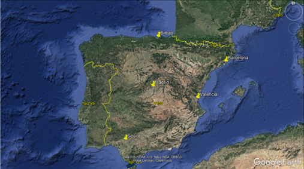

# EDA - Energy Demand Generation and Weather 
Data analysis exploration of 4 years of electrical consumption, generation, pricing, and weather data for Spain.  Hypothesis Investigation: Weather factors affect energy consumption and generation, which affect energy prices. 

  

2 csv files - [Kaggle dataset](https://www.kaggle.com/datasets/nicholasjhana/energy-consumption-generation-prices-and-weather?select=weather_features.csv):
- Energy dataset:   contains 4 years (2014-2018) of hourly electrical consumption, generation and pricing in Spain.
- Wheather dataset: contains 4 years (2014-2018) of hourly whether measurments in 5 cities in Spain: Madrid, Valencia, Bilbao, Barcelona and Seville.

## Hypothesis : Weather factors affect energy consumption and generation, which affect energy prices.

### Data Exploration

Eneregy
- Total Energy demand seem to drop in spring and autumn, and to rise in winter and summer.
- Energy demand prices seem to drop in spring time and rise around the peaks of the summer and winter.

  

Wheather: 
- Cities are distribution is relatively wide, therefore we will assume that the weather of all of Spain can be represented by these cities.
- All cities have similar number of measurements.

  

### Data Dropping
    
- Energy Dataset: Measurements with high consumption and very low generation (10,000): 

  

- Weather Dataset:

  - Data with exceptional pressure (< 900 hPa, > 1100 hPa)
  - Data with hourly rainfall of 12 mm in Barcelona in summer 2016 (after checking the site that displays the weather data, an incorrect figure appears).
  - Exceptional wind speed- 133 m/s in July (one observation).

### Different energy sources usage as function of time and their effect on energy prices

Predominant energy sources in Spain: fossil gass , hard coal ,wind.

  

Around february and march there is an increase of use of wind and energy and hydro water reservoir and decrease in the use of hard coal energy, while around june-september there is an increase in the use of solar energy and decrease in the use of wind energy.

